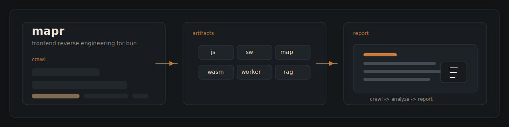

# Mapr



Mapr is a Bun-native CLI/TUI for reverse-engineering frontend websites and build outputs. It crawls a target site, collects analyzable frontend artifacts, runs a multi-agent AI analysis pipeline over chunked code, and writes a Markdown report with entry points, initialization flow, inferred call graph edges, restored names, artifact summaries, and investigation tips.

This repository is public for source visibility and collaboration. The license remains source-available and restricted. Read the contribution and license sections before reusing or contributing to the codebase.

## Highlights

- Bun-only CLI/TUI with interactive setup through `@clack/prompts`
- OpenAI and OpenAI-compatible provider support
- Built-in provider presets for BlackBox AI, Nvidia NIM, and OnlySQ
- Model discovery with searchable selection
- Automatic context-window detection from provider model metadata when available
- Same-origin crawler with bounded page count and crawl depth
- JS bundle, worker, service worker, WASM, and source-map discovery
- Iframe-aware crawling for same-origin embedded pages
- Local RAG mode for multi-megabyte bundles
- Partial-report persistence when analysis fails mid-run
- Headless automation mode for CI or batch workflows

## What It Analyzes

- HTML entry pages and linked same-origin pages for discovery
- JavaScript bundles, imported chunks, and inline bootstraps
- Service workers and worker scripts
- WASM modules through binary summaries
- Source maps and extracted original sources when available
- Same-origin iframe pages and the JS/WASM artifacts discovered inside them
- Optional local lexical RAG for oversized artifacts such as multi-megabyte bundles

Mapr does not analyze images, fonts, audio, video, PDFs, archives, or other presentation/binary assets.

## Runtime

- Bun only
- TypeScript in strict mode
- Interactive terminal UX with `@clack/prompts`
- AI analysis through Vercel AI SDK using OpenAI or OpenAI-compatible providers
- Built-in OpenAI-compatible presets for BlackBox AI, Nvidia NIM, and OnlySQ
- Automatic model context-size detection from provider model metadata when available
- Headless CLI mode for automation
- Live crawler and swarm progress with agent-level tracking and progress bars

## Install

Local development:

```bash
bun install
bun run index.ts
```

Published package usage:

```bash
npx @redstone-md/mapr --help
```

## Workflow

1. Load or configure AI provider settings from `~/.mapr/config.json`
2. Discover models from the provider catalog endpoint
3. Let the user search and select a model, auto-detect the model context size when possible, and fall back to a manual prompt when needed
4. Crawl the target website, same-origin iframe pages, and discovered code artifacts with bounded page count and crawl depth
5. Format analyzable content where possible
6. Optionally build a local lexical RAG index for oversized artifacts
7. Run a communicating swarm of analysis agents over chunked artifact content with structured-output fallback for providers that only support plain text
8. Generate a Markdown report in the current working directory

## Provider Presets

- `blackbox` -> `https://api.blackbox.ai`
- `nvidia-nim` -> `https://integrate.api.nvidia.com/v1`
- `onlysq` -> `https://api.onlysq.ru/ai/openai`
- `custom` -> any other OpenAI-compatible endpoint

## Usage

Interactive:

```bash
bun start
```

Headless:

```bash
npx @redstone-md/mapr \
  --headless \
  --url http://localhost:5178 \
  --provider-preset onlysq \
  --api-key secret \
  --model mistralai/devstral-small-2507 \
  --context-size 512000 \
  --local-rag \
  --max-depth 3
```

List models with detected context sizes when available:

```bash
npx @redstone-md/mapr --list-models --headless --provider-preset nvidia-nim --api-key secret
```

Useful flags:

- `--max-pages <n>` limits same-origin HTML pages
- `--max-artifacts <n>` limits total fetched analyzable artifacts
- `--max-depth <n>` limits crawler hop depth from the entry page
- `--local-rag` enables local lexical retrieval for oversized bundles
- `--verbose-agents` prints swarm completion events as they finish
- `--reconfigure` forces provider setup even if config already exists

## Swarm Design

Mapr uses a communicating agent swarm per chunk:

- `scout`: maps artifact surface area and runtime clues
- `runtime`: reconstructs initialization flow and call relationships
- `naming`: restores variable and function names from context
- `security`: identifies risks, persistence, caching, and operator tips
- `synthesizer`: merges the upstream notes into the final chunk analysis

Progress is shown directly in the TUI for crawler fetches, depth skips, discovered nested artifacts, and swarm agent/chunk execution.

## Large Bundle Handling

- Mapr stores the selected model context size and derives a larger chunk budget from it.
- When a provider exposes context metadata in its model catalog, Mapr saves that value automatically.
- Optional `--local-rag` mode builds a local lexical retrieval index so very large artifacts such as 5 MB bundles can feed more relevant sibling segments into the swarm without forcing the whole file into one prompt.
- Formatting no longer has a hard artifact-size cutoff. If formatting fails, Mapr falls back to raw content instead of skipping by size.

## Output

Each run writes a Markdown file named like:

```text
report-example.com-2026-03-15T12-34-56-789Z.md
```

If analysis fails after artifact discovery or formatting has already completed, Mapr still writes a partial report and includes the analysis error in the document.

## Limitations

- AI-generated call graphs and symbol renames are inferred, not authoritative.
- WASM analysis is summary-based unless deeper lifting/disassembly is added.
- Crawl scope is intentionally bounded by same-origin policy, page limits, artifact limits, and depth limits.
- Very large or heavily obfuscated bundles still depend on model quality and provider behavior.

## Disclaimer

- Mapr produces assisted reverse-engineering output, not a formal proof of program behavior.
- AI-generated call graphs, renamed symbols, summaries, and tips are inference-based and may be incomplete or wrong.
- Website analysis may include proprietary or sensitive code. Use Mapr only when you are authorized to inspect the target.
- WASM support is summary-based unless you extend the project with deeper binary lifting or disassembly.

## Contribution Terms

- This project is public and source-available, but it is not open source.
- Contributions are accepted only under the repository owner’s terms.
- By submitting a contribution, you agree that the maintainer may use, modify, relicense, and redistribute your contribution as part of Mapr without compensation.
- Do not submit code unless you have the rights to contribute it.

## License

Use of this project is governed by the custom license in [LICENSE](./LICENSE).
